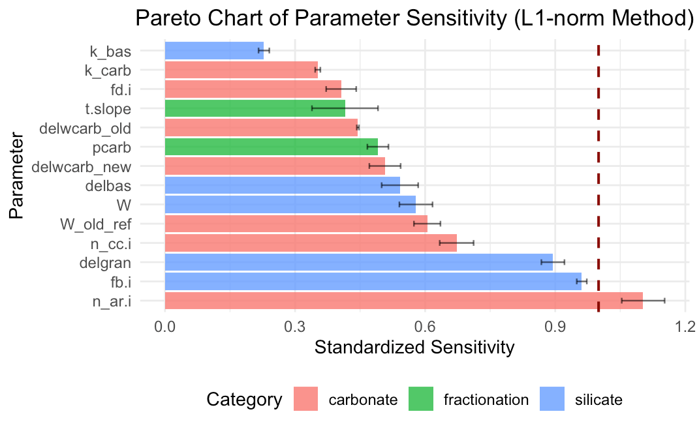
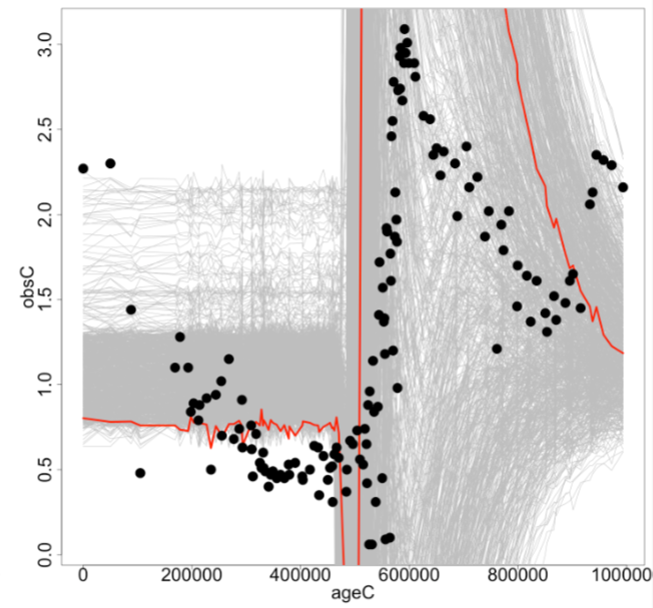

<b> Mentoring Philosophy </b>
My mentoring style in research settings blends facilitative with technical approaches which strikes a balance between independent thinking and self-advocacy around students' personal career goals, while ensuring they gain the transferable skills their career path requires. 

<b> Current Students </b>

I've had the pleasure to serve as research mentor with high school interns through the <a href="https://sustainability.stanford.edu/admissions-education/k-12-outreach/young-investigators">Stanford Young Investigators</a> Program. My students have been interrogating the sensitivity of isotope mass balance model responses to different parameterizations and discovering missing feedbacks for climate stabilization. Check out their AGU abstracts (TBD). 

Note: Because some of my students are minors I am deliberately not including full names and photos
