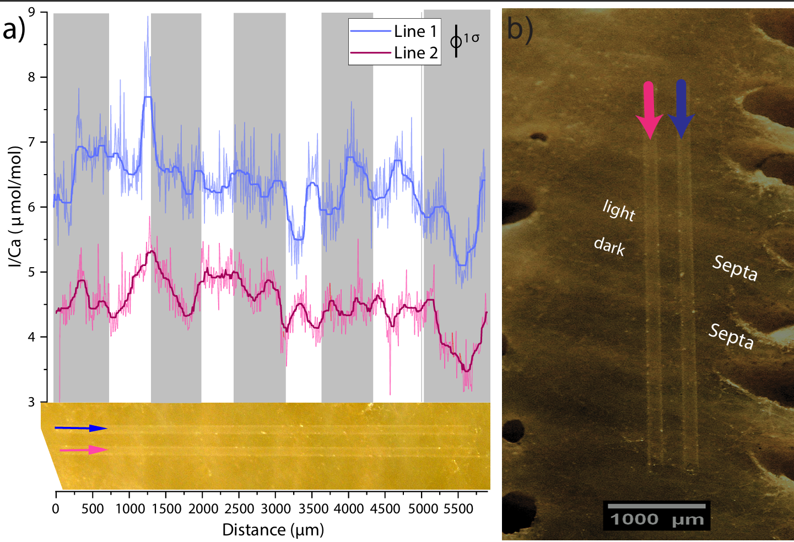

<b> Mapping iodine distributions in biotic carbonates </b>  

The I/Ca ratio of carbonates is a redox proxy that qualitatively tracks hypoxic conditions in 
regional water masses and can also trace reducing pore fluids. Only oxidized iodine species 
iodate are incorporated into carbonate minerals. Carbonates of biological origin such as 
foraminifera and corals have been shown to exhibit statistically higher I/Ca ratios in waters 
adjacent to expansive oxygen deficient zones compared to well oxygenated settings 
<a href="https://pubmed.ncbi.nlm.nih.gov/39923188/">(Prow-Fleischer and Lu, 2024)</a>.
However, effective use of I/Ca in biogenic carbonates as an environmental tracer requires a 
mechanistic understanding of how iodine is incorporated and distributed among skeletal components. 
This can be addressed through <i>insitu</i> elemental and speciation mapping, but progress is currently 
limited by the scarcity of reliable matrix-matched standards with certified iodine concentrations
for  measurements using laser-based introduction systems. My research aims to calibrate new 
reference materials in order to map iodine distributions, speciation and elemental covariation in corals. 
These measurements will provide foundational constraints on iodine incorporation mechanisms in coral 
skeletons and improve the utility of I/Ca as a paleoclimate proxy.

