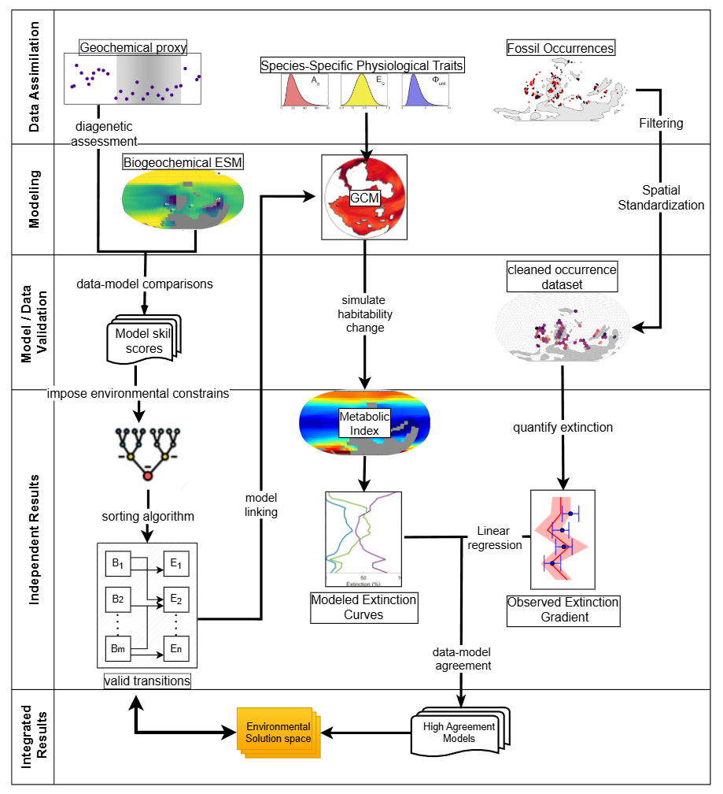
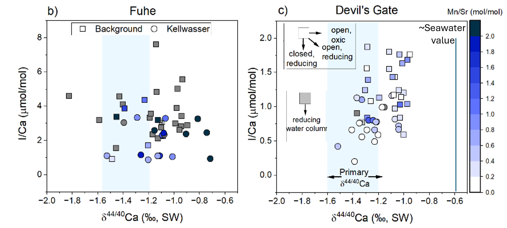

<b> Mapping iodine distributions in biotic carbonates </b>  

The I/Ca ratio of carbonates is a redox proxy that qualitatively tracks hypoxic conditions in 
regional water masses and can also trace reducing pore fluids. Only oxidized iodine species 
iodate are incorporated into carbonate minerals. Carbonates of biological origin such as 
foraminifera and corals have been shown to exhibit statistically higher I/Ca ratios in waters 
adjacent to expansive oxygen deficient zones compared to well oxygenated settings 
<a href="https://pubmed.ncbi.nlm.nih.gov/39923188/">(Prow-Fleischer and Lu, 2024)</a>.
However, effective use of I/Ca in biogenic carbonates as an environmental tracer requires a 
mechanistic understanding of how iodine is incorporated and distributed among skeletal components. 
This can be addressed through <i>insitu</i> elemental and speciation mapping, but progress is currently 
limited by the scarcity of reliable matrix-matched standards with certified iodine concentrations
for  measurements using laser-based introduction systems. My research aims to calibrate new 
reference materials in order to map iodine distributions, speciation and elemental covariation in corals. 
These measurements will provide foundational constraints on iodine incorporation mechanisms in coral 
skeletons and improve the utility of I/Ca as a paleoclimate proxy.

Funding sources: Geological Society of America student research grant to A. Prow

<b> Modeling Drivers of Late Devonian Mass Extinction Selectivity and Environmental Changes </b>  

The Late Devonian Kellwasser events were characterized by climate cooling and enhanced organic matter burial coupled to widespread deoxygenation. The complex spatial patterns in the biological response to the Kellwasser events have challenged our understanding of the primary kill mechanism and the driving environmental transitions since the recognition of the Kellwasser shale a hundred years ago. Through earth system and box modeling I aim to reconcile environmental and climate state transitions of the Kellwasser Events. I use novel data assimilation and Bayesian methods to filter models realizations for agreement with spatial patterns of geochemical and biological responses. Through modeling I have shown that increases in limiting nutrients is a prerequisite for the events regardless of other environmental factors (Prow-Fleischer in prep) and currently I am investigating the solution space of flux changes that substantiate both increased organic matter burial and carbonate saturation through the coupled response of carbon and calcium isotopes ratios. 

This research was supported by NSF Frontier Research in Earth Sciences awarded to PI's Lu and Payne

<b> Calcium Isotope Ratios as Indicators for carbonate-based Redox Proxy Preservation  </b>  

Calcium isotope ratios, while responding to both local and global changes in dissolved carbonate dynamics, are also sensitive to fluid–rock interaction, and certain alteration pathways can produce systematic trends in the covariation of δ⁴⁴Ca and other trace elements. Specifically, they can be helpful in diagnosing the fidelity of redox proxy signals when paired with other redox or recrystallization indicators <a href="https://doi.org/10.1016/j.chemgeo.2024.122530">(Prow-Fleischer et al. 2025)</a>. I use a method I developed to investigate latitudinal trends in Triassic upper-ocean redox state in the Paleo-Tethys, pairing new δ⁴⁴Ca data with other available datasets to show that, even under conditions of high fluid exchange, redox signals can be largely conserved. This method can also be used to screen datasets that should not be used for quantitative reconstructions (in prep.).	

<b> Tentaculites  </b>  

Tentaculites are an enigmatic group of carbonate-based microfossils of uncertain taxonomic affinity that were prolific during the Middle to Late Paleozoic, but went extinct during the Late Devonian Kellwasser events. I found that during warming events, dacryoconarids, a planktonic class of tentaculitoids, may have responded by growing smaller <a href="https://doi.org/10.1130/GES02759.1">(Prow et al. 2024)</a>. This has implications for energy transfer within the Devonian upper ocean, when they would have been an abundant contributor to upper-ocean biomass and carbon burial in deep basins. My research questions moving forward are to investigate how important the disappearance of their size class was to the destabilization of upper-ocean carbonate saturation and organic matter remineralization depth during the Kellwasser Events. I am also working with the Paleobiology Database to update their classification within the database to modern standards.

